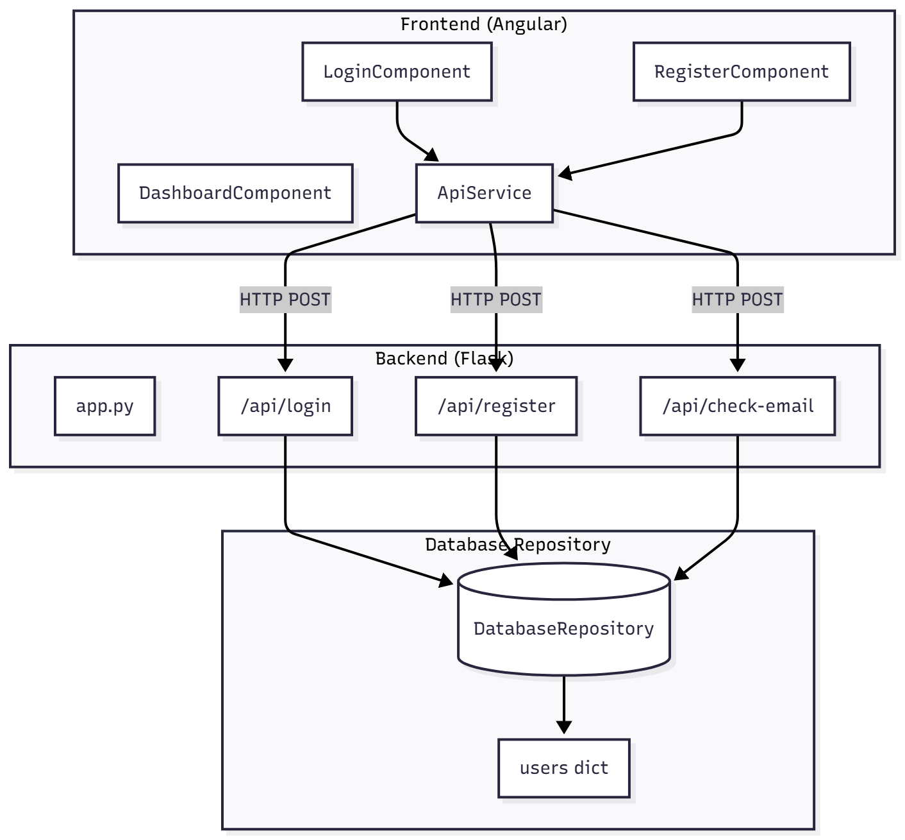
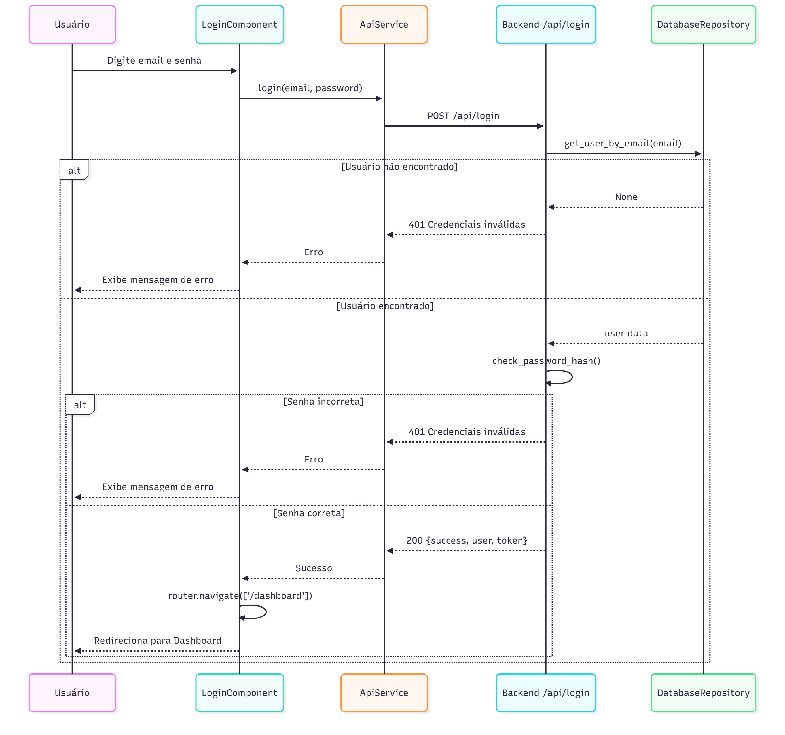
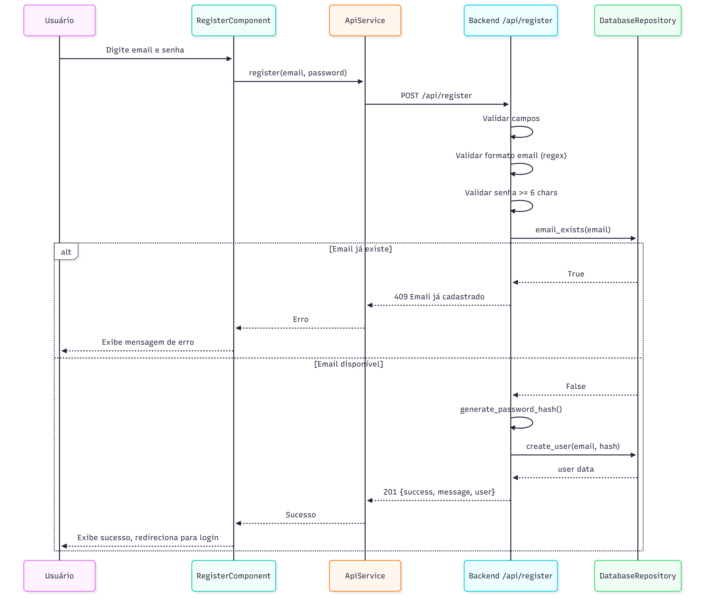

<div align="center">

# Findor - Sistema de Autenticação


Sistema de login e cadastro com Angular + Flask.

</div>

## Arquitetura



## Tecnologias

**Frontend:** Angular 21, TypeScript, SCSS  
**Backend:** Python 3, Flask

## Como Executar

### Backend
```bash
cd backend
python -m venv venv
venv\Scripts\activate      # Windows
# source venv/bin/activate # Linux/Mac
pip install -r requirements.txt
python app.py
```
Acesse: `http://127.0.0.1:5000`

### Frontend
```bash
cd frontend/login-app
npm install
npm start
```
Acesse: `http://localhost:4200`

## Fluxos

### Login


### Cadastro


## Endpoints da API

| Método | Rota | Descrição |
|--------|------|-----------|
| POST | `/api/login` | Autenticação de usuário |
| POST | `/api/register` | Cadastro de novo usuário |
| POST | `/api/check-email` | Verifica se email existe |
| GET | `/api/health` | Status do servidor |


Para detalhes do desafio técnico, consulte [desafio.md](desafio.md)

